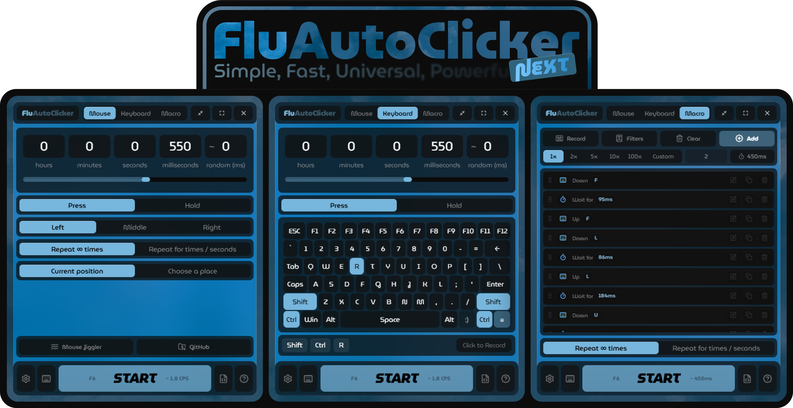
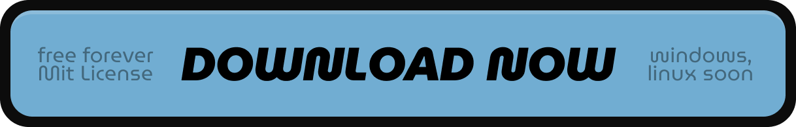

<div align="center">

> ⚠️ Warning: FluAutoClicker is an early beta. Expect rough edges, changing behavior, and occasional breakage.

<a href="https://agzes.github.io/go/to/discord">
  
</a>



***A modern, cross-platform, open-source automation tool for mouse clicks, keyboard input, and macros.***
<a href="https://github.com/Agzes/FluAutoClicker/releases/latest">
  
</a>

</div><br>

## What is FluAutoClicker?

FluAutoClicker is a Rust + Tauri desktop app for fast, configurable input automation. It started as an auto clicker (see [old branch](https://github.com/Agzes/FluAutoClicker/tree/main)), but the current beta is closer to a compact automation suite: mouse clicking, keyboard pressing, macro recording/playback, profiles, global hotkeys, and Linux-oriented input support in the same app.


## Features

- **Mouse mode**: automate left, right, middle mouse buttons.
- **Keyboard mode**: repeat a key or key combination, including modifiers such as Ctrl, Alt, Shift, and Win/Super.
- **Macro mode**: build, record, reorder, duplicate, and replay multi-step macros with mouse, movement, keyboard, and delay actions.
- **Press or hold behavior**: use regular presses or hold actions with configurable durations.
- **Current or fixed cursor position**: click where the cursor is, or target a saved coordinate.
- **Repeat control**: run forever, repeat a fixed number of times, or run for a fixed duration.
- **Timing variation**: add random variation to mouse or keyboard intervals.
- **Mouse Jiggler**: keep the cursor moving with random, linear, circle, or O-Zone behavior.
- **Profiles and config import/export**: save different automation setups and move them as JSON.
- **Global hotkeys**: start/stop the active mode, pick cursor position, and toggle macro recording.
- **System tray**: keep the app available while minimized.
- **CLI hooks**: start, stop, toggle, or exit from the command line.
- **Open source**: licensed under MIT.

## Modes

### Mouse Mode

Mouse mode is the classic auto-clicker workflow. You can choose the button, click style, CPS, repeat behavior, coordinate mode, hold duration, and optional random timing variation.

> 🐧 On Linux, FluAutoClicker uses a virtual input device through `/dev/uinput` for mouse events.

### Keyboard Mode

Keyboard mode repeats keyboard input instead of mouse clicks. It supports a target key + optional modifiers, press/hold behavior, repeat limits, and interval variation.

Examples:

- Press `A` repeatedly.
- Press `Ctrl+S` every few seconds.
- Hold a key for a configured duration.

> 🐧 On Linux, keyboard automation also uses `/dev/uinput`.

### Macro Mode

Macro mode is for multi-action automation. A macro can contain:

- Mouse actions with optional positions.
- Cursor movement, including instant or smooth movement.
- Keyboard actions with modifiers.
- Sleep/delay actions.

Macros can be recorded, edited, duplicated, reordered with drag-and-drop, saved, and replayed with infinite, finite-times, or finite-duration repeat modes.

## Platform Support

| Platform | Status | Notes |
| --- | --- | --- |
| Windows | Supported | Main development target. Acrylic window effects, startup registration, tray, hotkeys, mouse mode, keyboard mode, and macro playback are supported. |
| Linux | Beta support | CI builds AppImage, DEB, and RPM artifacts. Mouse and keyboard automation use `/dev/uinput`; permissions may need to be granted. Global hotkeys are disabled on Wayland sessions. |
| macOS | Source-level | Tauri and the input backend can target macOS, but no release builds are currently published by this repository. Not tested, not guaranteed to work. |

### Linux uinput permissions

If Linux input emulation does not work, make sure `/dev/uinput` is available and writable for your user. The app can try to request permissions through `pkexec`, or you can configure a proper udev rule for your distribution.

Quick temporary check:

```bash
ls -l /dev/uinput
```

Temporary permission change:

```bash
sudo chmod 666 /dev/uinput
```

For daily use, prefer a udev rule instead of changing permissions manually after every boot. (auto-fix will be added in future)

## Hotkeys and CLI

Default runtime hotkeys: (can be changed in UI)

| Action | Default |
| --- | --- |
| Toggle active mode start/stop | `F6` |
| Pick cursor position | `Ctrl+P` |
| Toggle macro recording | `Ctrl+Shift+R` |

The app also exposes command-line switches through the Tauri CLI plugin: (beta)

```bash
FluAutoClicker --toggle
FluAutoClicker --start
FluAutoClicker --stop
FluAutoClicker --exit
```

## Install

Download the latest beta from [GitHub Releases](https://github.com/Agzes/FluAutoClicker/releases/latest).

Release automation currently produces:

- `FluAutoClicker-X.Y.Z-windows-x64.exe` - Windows x64 executable.
- `FluAutoClicker-X.Y.Z-linux-x64.AppImage` - Linux x64 AppImage.
- `FluAutoClicker-X.Y.Z-linux-x64.deb` - Linux x64 DEB package.
- `FluAutoClicker-X.Y.Z-linux-x64.rpm` - Linux x64 RPM package.
- `SHA256SUMS.txt` - SHA256 sums for release assets.

## Build from Source

Requirements:

- Rust stable (rustup recommended)
- Node.js 20+ 
- pnpm 9+ (you can try use npm, but not recommended)
- Platform dependencies required by Tauri (webview2 on windows, libgtk3-dev on linux, or other, check Tauri docs)

Install dependencies:

```bash
pnpm install
```

Run in development mode:

```bash
pnpm tauri dev
```

Build the frontend:

```bash
pnpm run build
```

Build the desktop app:

```bash
pnpm tauri build
```

Beta builds can enable the beta DevTools feature:

```bash
pnpm tauri build --features beta-devtools
```

## Development tests

```bash
pnpm run typecheck
pnpm run smoke:static
pnpm run lint
pnpm run test:rust
```

## Responsible Use

Automation tools can violate the rules of games, websites, workplaces, or online services. Use FluAutoClicker only where automation is allowed, and do not use it to abuse systems, bypass fair-play rules, or perform unwanted actions on someone else's device.

<br><br><br><div align="center">

<a href="https://agzes.github.io/">
  
</a>

`ℹ️` Looking for the C# version? Switch to the [old branch](https://github.com/Agzes/FluAutoClicker/tree/main). <br>
`🛡️` [Mit License](https://github.com/Agzes/FluAutoClicker/LICENSE)

</div>